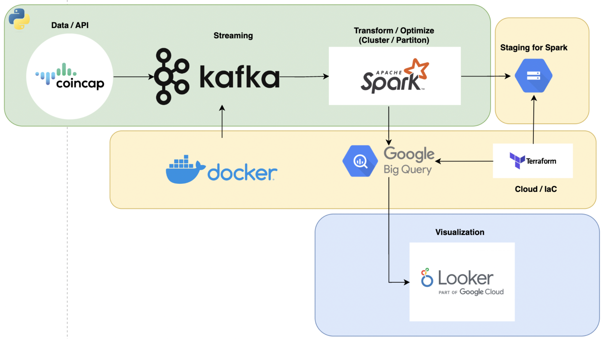
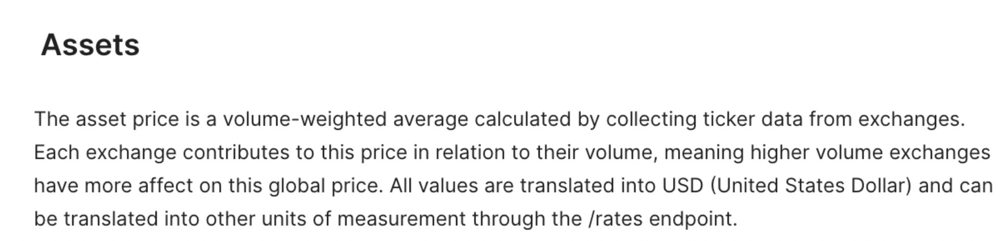
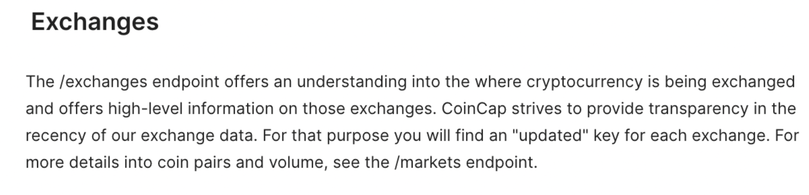
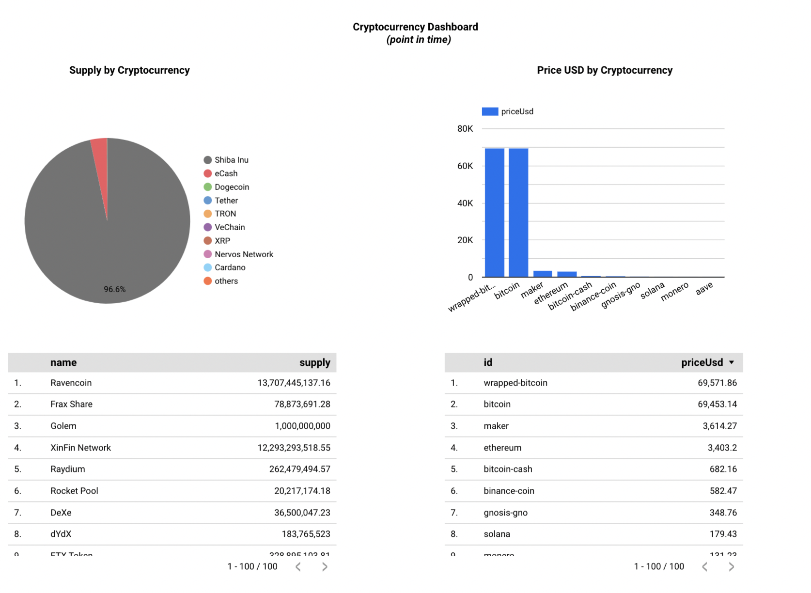

**Problem description**

The purpose of this repo is to show a representation of cryptocurrencies to allow an analytical user to look at trends over time.
This would allow for a visualization of data in near real-time to see how different factors of a cryptocurrency coin change over time.
The different variables may be price USD, market cap USD, max supply, and Rank in comparison to different coins.
In this part, if someone used one exchange, they may not know how certain cryptocurrencies traded or are available on other exchanges.

This also demonstrates the different exchanges and metrics around each, with changes in near real-time. 
The metrics here include percent total volume, volume usd, and rank across the different exchanges.
In this part, if someone were to use one exchange, they may not be aware of the activity on different exchanges and how that may change over time. 

The intention of the pipeline is to communicate data that may be complex in a more clear and readily available way.

Disclaimer: This is purely an analytical exercise to demonstrate a POC and not to be used in any way. This is in no way affiliated with Coincap.

**Architecture**

This pipeline:
   1. pulls the data from Coincap API 
   2. creates topics in Kafka for a consumer to subscribe to
   3. Transforms data to a structured and optimized format in spark
   4. Loads to Bigquery to be used for analysis
   5. Demonstrates the data in Looker Studio

**Cloud**
IaC: Terraform
Cloud: GCP

**Data ingestion (choose either batch or stream)**
Stream: Kafka streaming

**Data warehouse:** Partitioned and clustered in Spark

The `processing_timestamp` field is being used for Partitioning as that would be the primary field that is used for analysis. We will look for the latest data that is processed.

The `id` and `exchangeId` fields are used for the clustering. These fields are primarily used in aggregation and joins.

**Transformations:** Topic Transformation and Column Transformations in Spark

**Dashboard**: Looker Studio

**Reproducibility**: See below

In this project, the Coincap API is used to provide the data. 
Terraform is used to produce the resources in Google Cloud Platform.
Kafka is running on docker as completed in the course. 
Spark is used to read in the topics from Kafka and transformed to load into Bigquery.
Data is stored in Bigquery and processing is completed in google cloud storage.
Visualization is completed using Looker Studio.

**More information on data**

In doing this, the [Capcoin](https://docs.coincap.io/) API is used to provide the data.
The **Assets** endpoint is used to get the coin ticker data using volume-weighted-average based on trading volume.
The **Exchange** endpoint is used to provide trading data on each exchange at the point in time.s

More information on those from Coincap data below: 

Assets (As defined by Coincap website):

Exchanges (As defined by Coincap website):

**Instructions**
In order to reproduce this locally, there are a series of steps to follow. Local configurations may be needed along the way.

1. Clone repo 
2. Set up virtual environment, install python 3.9.9
3. Install docker (and turn on)
3. Install python requirements `pip install -r requirements.txt`
4. Run `docker compose -up` to start the kafka stream processing 
5. To test producer, run `python3 src/asset_producer.py` followed by `python3 src/asset_consumer.py`
6. Update Terraform 
7. Create resources in GCS during Terraform
   - terraform init 
   - terraform plan
   - terraform apply
6. Populate GCS Project, Dataset, Credentials in `src/config.py`
   7. Ensure Service Account has appropriate credentials in GCP project to write to GCS and BQ
7. NOTE: Make sure Hadoop and Spark Environments are set up. If this is not done prior, this done will note.
8. Run `./spark-submit.sh pyspark_etl.py`
9. If running into issues, try to run the cells in `src/Assets_ETL_Bigquery.ipynb`

**Visualization**
[Link](https://lookerstudio.google.com/reporting/5ee619d7-9a0e-4ee2-ab61-a54625378c19) to Dashboard

Below demonstrates a comparison of the suppy by Cryptocurrency at a point in time on the left side.

This also shows the breakdown of the price at the point in time as well on the right side. 

!